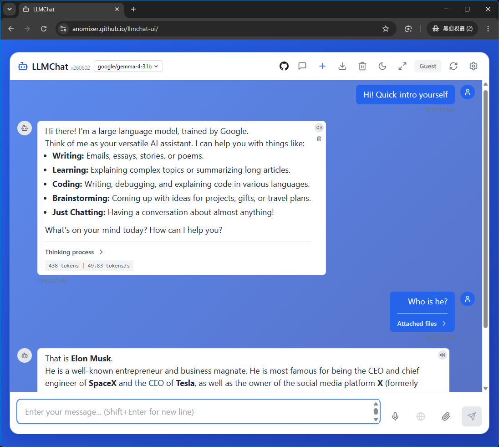
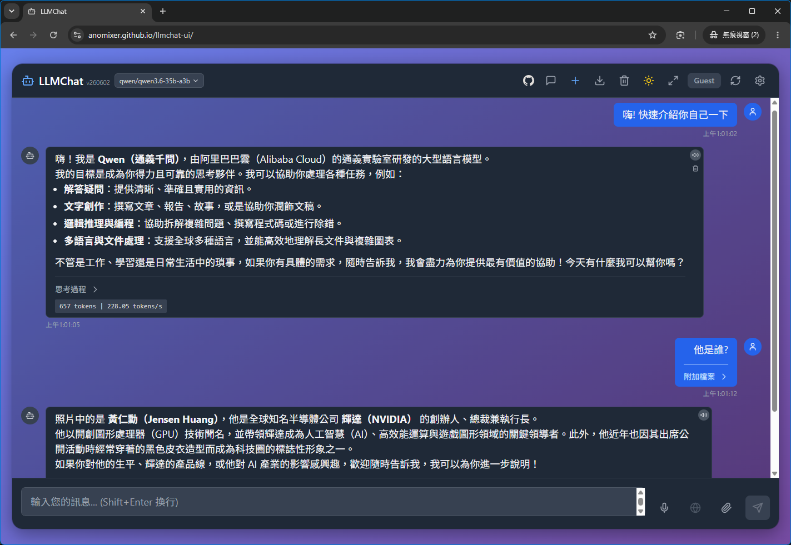

# LLMChat-UI

[English](#english-readme) | [繁體中文](#中文說明)

---

## English README

A modern, glassmorphic LLM client interface running entirely in your browser. It communicates directly with Ollama, OpenAI, DeepSeek, Groq, and custom OpenAI-compatible API endpoints without requiring any backend servers. Ideal for static hosting platforms like Vercel, Netlify, or GitHub Pages.



> [!NOTE]
> - This project is the pure client-side (serverless) version of the parent project [LLMChat](https://github.com/anomixer/llmchat). For developer API schemas and release notes, please refer to the [API Document](api.md) and [CHANGELOG.md](CHANGELOG.md).
> - **Note**: The pure client-side version does not support custom web search/crawler functionality for now.

[](https://vercel.com/new/clone?repository-url=https%3A%2F%2Fgithub.com%2Fanomixer%2Fllmchat-ui)
[](https://app.netlify.com/start/deploy?repository=https://github.com/anomixer/llmchat-ui)

### 🌟 Key Features

- **Pure Client-Side Architecture**: Operates 100% inside your browser. All data (conversations, history, settings) is stored securely in your browser's local storage (`localStorage`).
- **Direct API Connectivity**: Direct connection to local Ollama (`http://localhost:11434`) or cloud providers (OpenAI, DeepSeek, Groq, or any OpenAI-compatible API URL).
- **DeepSeek R1 & Reasoning Support**: Beautiful display of reasoning steps for thinking models (e.g. DeepSeek R1), with collapsible reasoning/thinking blocks.
- **Glassmorphic UI**: High-end glassmorphism design with responsive dark/light/system theme modes, featuring a spacious 2x2 grid layout for AI provider configurations.
- **Rich Generation Controls**: Fine-tune your AI responses with comprehensive parameters including Temperature, Top P, Top K, and Max Tokens (Context Size).
- **Rich Interaction**: Supports voice speech-to-text input, text-to-speech audio outputs, file attachments (context sharing), code blocks copy-pasting, and markdown rendering.
- **Keyboard Shortcuts**: Maximize efficiency with built-in hotkeys.
- **Data Portability**: Import and export your conversations to JSON or Markdown formats.

### 📋 Prerequisites

- **Node.js**: 16.0.0 or higher
- **NPM**: 8.0.0 or higher
- **Ollama**: If using a local LLM environment (ensure CORS is enabled: `OLLAMA_ORIGINS="*" ollama serve`).

### 🚀 Getting Started

#### 1. Install Dependencies
```bash
npm install
```

#### 2. Configure Local Settings (Optional)
Copy `.env.example` to `.env` to configure your build-time default settings:
```bash
cp .env.example .env
```
Available properties:
- `VITE_DEFAULT_PROVIDER_TYPE`: The default provider (`ollama`, `openai`, `deepseek`, `groq`, `custom`).
- `VITE_OLLAMA_API_URL`: The default URL for Ollama service.
- `VITE_DEFAULT_MODEL`: The default model name to start with.

#### 3. Run Development Server
```bash
npm run dev
```
Open `http://localhost:3000` to start chatting!

### ⚙️ API configuration & CORS

Because LLMChat-UI runs entirely in the browser, direct cloud API connections (e.g., to OpenAI, DeepSeek, Google Gemini, or GitHub Models) might be blocked by CORS unless:
1. You use a local Ollama instance with CORS allowed (`OLLAMA_ORIGINS="*" ollama serve`).
2. You use a browser extension to bypass CORS policies (e.g., "Allow CORS: Access-Control-Allow-Origin").
3. You run a local CORS reverse-proxy for cloud APIs.
4. You configure your own proxy server endpoint in settings.

*Tip: The client features an advanced endpoint resolver (`resolveEndpoints`). It automatically cleans up any base URL suffixes (such as `/chat/completions`, `/v1/chat/completions`, or `/v1beta/openai`) to correctly deduce the chat completion and model listing endpoints. This enables full compatibility with custom proxy servers, Google Gemini's OpenAI-compatible gateways, and Vercel/Cloudflare AI Gateways.*

*GitHub Models OAuth: If you use the GitHub Models provider, you can log in interactively via GitHub OAuth (PKCE) by entering your custom OAuth App Client ID, or manually paste a Personal Access Token (PAT) with `read:packages` permission.*

> [!WARNING]
> **Conflict with "Page Assist" and other Ollama Web UI extensions:**
> If you have extensions like [Page Assist](https://chromewebstore.google.com/detail/page-assist-a-web-ui-for/jfgfiigpkhlkbnfnbobbkinehhfdhndo) installed and enabled, they may intercept all API requests targeting Ollama. In Chrome's standard mode, this interception rewrites the `Origin` header to match the target host, tricking the server but causing Chrome to block the response with CORS errors (`net::ERR_CONNECTION_REFUSED` or missing headers). 
> **To resolve this, please temporarily disable Page Assist or configure it to ignore your custom Ollama domains, or run the browser in Incognito mode / Firefox.** *(A diagnostic warning is also displayed directly in the connection error message to assist you.)*

### ☁️ Cloud Deployments

#### Vercel
1. Sign up on [vercel.com](https://vercel.com).
2. Connect your GitHub repository.
3. Deploy! The project's `vercel.json` will be automatically loaded to configure build and output directories.

#### Netlify
1. Sign up on [netlify.com](https://netlify.com).
2. Connect your GitHub repository.
3. Deploy! The project's `netlify.toml` will be automatically loaded to configure build settings and SPA redirects.

#### GitHub Pages
1. Push your code to the `main` branch.
2. The GitHub Action in `.github/workflows/deploy.yml` will automatically build the site and deploy it to the `gh-pages` branch.
3. Go to Repository Settings -> Pages, and set the build source to the `gh-pages` branch.

---

## 中文說明

一個運行於瀏覽器端的現代化大語言模型用戶端 (LLM Client)，採用**純前端靜態架構**。不需依賴後端 Node.js 伺服器，直接與本地的 Ollama、OpenAI、DeepSeek、Groq 或任何相容 OpenAI 格式的 API 終端直接連線，非常適合部署在 Vercel、Netlify、GitHub Pages 等靜態託管平台。



> [!NOTE]
> - 本專案是母專案 [LLMChat](https://github.com/anomixer/llmchat) 的純前端客戶端（免伺服器）版本。詳細的開發者 API 連線規格與版本演進歷程，請參閱 [API 對接文件](api.md) 與 [更新日誌 CHANGELOG.md](CHANGELOG.md)。
> - 💡 純前端版暫不支援自訂聯網搜尋功能。

### 🌟 功能特色

- **純前端無後端架構**：100% 於瀏覽器內執行。所有的對話歷史記錄、API 設定、密鑰都安全地儲存於本地 `localStorage`，保障私隱。
- **多元 AI 供應商連線**：支援本地 Ollama (`http://localhost:11434`)，以及 OpenAI, DeepSeek, Groq 或者是任何自定義的 OpenAI 規格網址。
- **DeepSeek R1 思考過程顯示**：完整支援流式思考輸出，提供精美的可折疊思考區塊，方便閱讀推理過程。
- **現代玻璃擬態介面**：極致美學的毛玻璃設計，具備亮色、暗色與隨系統變換的自適應主題，並配備寬敞的 2x2 網格 AI 供應商配置介面。
- **進階生成參數控制**：支援完整的模型微調參數，包含 Temperature、Top P、Top K 與 Max Tokens (Context Size)。
- **多功能對話輔助**：支援語音辨識輸入、語音朗讀、文字與檔案上傳（作為對話上下文）、程式碼區塊一鍵複製等。
- **快捷鍵操作**：使用鍵盤快捷鍵快速新增對話、清除內容、開啟設定，提供專業使用者高效率工作流。
- **對話匯入與匯出**：可一鍵將對話記錄匯出為 JSON 與 Markdown 格式。

### 📋 系統需求

- **Node.js**: 16.0.0 或更高版本
- **NPM**: 8.0.0 或更高版本
- **Ollama**: 若欲連線本地模型，請確保已啟動且啟用 CORS (例如執行 `OLLAMA_ORIGINS="*" ollama serve`）。

### 🚀 快速開始

#### 1. 安裝套件
```bash
npm install
```

#### 2. 設定預設變數 (可選)
複製並編輯環境變數檔案以配置預設首頁變數：
```bash
cp .env.example .env
```
可調整之屬性包括：
- `VITE_DEFAULT_PROVIDER_TYPE`：預設的供應商類型。
- `VITE_OLLAMA_API_URL`：預設本地 Ollama API 網址。
- `VITE_DEFAULT_MODEL`：預設啟用的模型名稱。

#### 3. 啟動開發伺服器
```bash
npm run dev
```
在瀏覽器中開啟 `http://localhost:3000` 即可開始使用！

### ⚙️ CORS 與 API 金鑰說明

由於本專案為純前端應用：
1. **本地執行 Ollama**：在本地調用 Ollama 時，必須確保設定環境變數 `OLLAMA_ORIGINS="*"` 啟動，否則瀏覽器會因跨來源請求 (CORS) 阻擋連線。
2. **雲端 API 密鑰**：若直接在瀏覽器呼叫 OpenAI、Gemini 或 GitHub Models 的官方雲端 API，請確認您的瀏覽器已啟用 CORS 繞過插件（例如安裝 Chrome 擴充套件 「Allow CORS: Access-Control-Allow-Origin」並啟用），或者使用自建的反向代理伺服器（CORS Proxy）以轉發請求。所有密鑰與 Token 將安全儲存於您的本機網頁快取 (`localStorage`)，絕不上傳到任何第三方伺服器。

*提示：專案配置了先進的智慧端點解析器 (`resolveEndpoints`)，會自動清理與辨識 API URL 後置的路徑（如 `/chat/completions`、`/v1/chat/completions` 或 `/v1beta/openai`），並自動拼接對應的 models 與 chat 接口。這能完美相容於各種自定義 Proxy 代理網址、Google Gemini OpenAI 相容 Gateway、以及 Vercel/Cloudflare AI Gateway。*

*GitHub Models OAuth 登入：本專案為 GitHub Models 設計了基於安全的 PKCE 授權碼流登入機制。您可以註冊自己的 GitHub OAuth App（回調與主頁網址皆設定為當前網頁 origin）並輸入 Client ID 來一鍵完成授權；或者，您也可以手動建立具有 `read:packages` 權限的 GitHub 個人存取權杖 (PAT) 並貼在 API Key 欄位使用。*

> [!WARNING]
> **與 Page Assist 等 Ollama 瀏覽器插件的相衝突問題：**
> 若您安裝並啟用了 [Page Assist](https://chromewebstore.google.com/detail/page-assist-a-web-ui-for/jfgfiigpkhlkbnfnbobbkinehhfdhndo) 等 Ollama 網頁輔助插件，它們會在 Chrome 一般模式下自動攔截所有發往 Ollama 的請求。此攔截機制會將請求的 `Origin` 標頭竄改為目標主機，雖然騙過了伺服器端，但會導致瀏覽器本身以 CORS 安全錯誤阻擋回應（顯示 `net::ERR_CONNECTION_REFUSED` 或 CORS Header 缺失）。
> **解決方法：請暫時停用 Page Assist 插件、將您的自訂 Ollama 網域加入排除名單，或者改用無痕模式/無安裝該插件的瀏覽器（如 Firefox）進行測試。** *(在 API 連線測試失敗時，系統也會在錯誤訊息中提供此項診斷提示，方便您快速定位問題。)*

### ☁️ 部署說明

#### Vercel 部署
1. 註冊並登入 [vercel.com](https://vercel.com)。
2. 匯入您的 GitHub 專案。
3. 點選 Deploy 即完成！Vercel 將自動讀取專案中的 `vercel.json` 配置檔，套用預設的靜態網站與編譯設定進行發佈。

#### Netlify 部署
1. 註冊並登入 [netlify.com](https://netlify.com)。
2. 匯入您的 GitHub 專案。
3. 點選 Deploy，Netlify 將自動讀取專案中的 `netlify.toml` 設定檔，套用預設的靜態網站與 SPA 路由重定向配置進行發佈。

#### GitHub Pages 部署
1. 將代碼推送至 `main` 分支。
2. 專案中已配置 `.github/workflows/deploy.yml` 工作流，GitHub Actions 會自動執行編譯並發佈至 `gh-pages` 分支。
3. 前往 GitHub 專案設定 -> Pages，將來源分支設定為 `gh-pages` 即可完成部署與開啟線上 demo。
