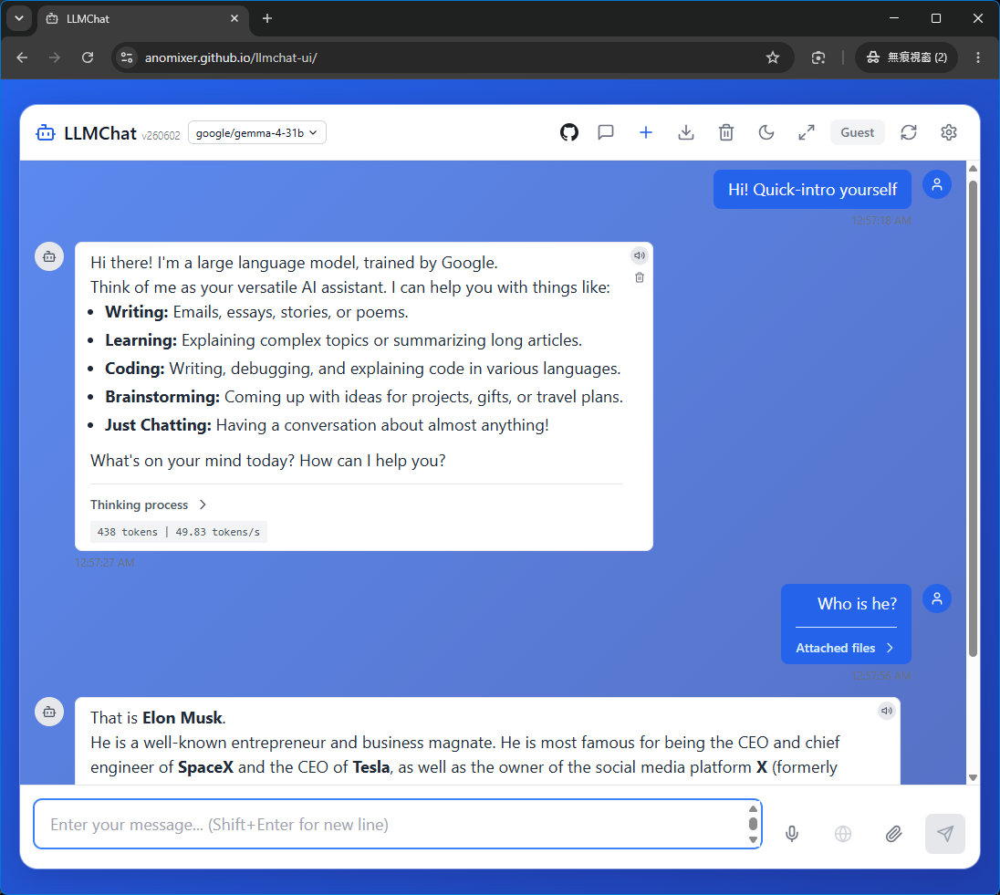

> 🇹🇼 繁體中文: [readme.md](readme.md)

# LLMChat-UI

---

## English README

A modern, glassmorphic LLM client interface running entirely in your browser. It communicates directly with Ollama, OpenAI, DeepSeek, Groq, and custom OpenAI-compatible API endpoints without requiring any backend servers. Ideal for static hosting platforms like Vercel, Netlify, or GitHub Pages.



> [!NOTE]
> - This project is the pure client-side (serverless) version of the parent project [LLMChat](https://github.com/anomixer/llmchat). For developer API schemas and release notes, please refer to the [API Document](api.md) and [CHANGELOG.md](CHANGELOG.md).
> - **Note**: The pure client-side version does not support custom web search/crawler functionality for now.

[](https://vercel.com/new/clone?repository-url=https%3A%2F%2Fgithub.com%2Fanomixer%2Fllmchat-ui)
[](https://app.netlify.com/start/deploy?repository=https://github.com/anomixer/llmchat-ui)

### 🌟 Key Features

- **Pure Client-Side Architecture**: Operates 100% inside your browser. All data (conversations, history, settings) is stored securely in your browser's local storage (`localStorage`).
- **Direct API Connectivity**: Direct connection to local Ollama (`http://localhost:11434`) or cloud providers (OpenAI, DeepSeek, Groq, or any OpenAI-compatible API URL).
- **DeepSeek R1 & Reasoning Support**: Beautiful display of reasoning steps for thinking models (e.g. DeepSeek R1), with collapsible reasoning/thinking blocks.
- **Glassmorphic UI**: High-end glassmorphism design with responsive dark/light/system theme modes, featuring a spacious 2x2 grid layout for AI provider configurations.
- **Rich Generation Controls**: Fine-tune your AI responses with comprehensive parameters including Temperature, Top P, Top K, and Max Context Size.
- **Context Usage Indicator & Chat Compaction**: A live indicator next to the model selector shows the current conversation's token usage (`xxxK (nnn%)`), and the `/compact` command (or clicking the indicator) auto-summarizes history to free up context space and avoid hitting token limits on long conversations.
- **Rich Interaction**: Supports voice speech-to-text input, text-to-speech audio outputs, file attachments (context sharing), code blocks copy-pasting, and markdown rendering.
- **Multilingual UI**: 5 languages supported (zh-TW, zh-CN, English, Japanese, Korean), switchable instantly in the settings panel.
- **Keyboard Shortcuts**: Maximize efficiency with built-in hotkeys.
- **Data Portability**: Import and export your conversations to JSON or Markdown formats.

### 📋 Prerequisites

- **Node.js**: 16.0.0 or higher
- **NPM**: 8.0.0 or higher
- **Ollama**: If using a local LLM environment (ensure CORS is enabled: `OLLAMA_ORIGINS="*" ollama serve`).

### 🚀 Getting Started

#### 1. Install Dependencies
```bash
npm install
```

#### 2. Configure Local Settings (Optional)
Copy `.env.example` to `.env` to configure your build-time default settings:
```bash
cp .env.example .env
```
Available properties:
- `VITE_DEFAULT_PROVIDER_TYPE`: The default provider (`ollama`, `openai`, `deepseek`, `groq`, `custom`).
- `VITE_OLLAMA_API_URL`: The default URL for Ollama service.
- `VITE_DEFAULT_MODEL`: The default model name to start with.

#### 3. Run Development Server
```bash
npm run dev
```
Open `http://localhost:3000` to start chatting!

### ⚙️ API configuration & CORS

Because LLMChat-UI runs entirely in the browser, direct cloud API connections (e.g., to OpenAI, DeepSeek, Google Gemini, or GitHub Models) might be blocked by CORS unless:
1. You use a local Ollama instance with CORS allowed (`OLLAMA_ORIGINS="*" ollama serve`).
2. You use a browser extension to bypass CORS policies (e.g., "Allow CORS: Access-Control-Allow-Origin").
3. You run a local CORS reverse-proxy for cloud APIs.
4. You configure your own proxy server endpoint in settings.

*Tip: The client features an advanced endpoint resolver (`resolveEndpoints`). It automatically cleans up any base URL suffixes (such as `/chat/completions`, `/v1/chat/completions`, or `/v1beta/openai`) to correctly deduce the chat completion and model listing endpoints. This enables full compatibility with custom proxy servers, Google Gemini's OpenAI-compatible gateways, and Vercel/Cloudflare AI Gateways.*

*GitHub Models OAuth: If you use the GitHub Models provider, you can log in interactively via GitHub OAuth (PKCE) by entering your custom OAuth App Client ID, or manually paste a Personal Access Token (PAT) with `read:packages` permission.*

> [!WARNING]
> **Conflict with "Page Assist" and other Ollama Web UI extensions:**
> If you have extensions like [Page Assist](https://chromewebstore.google.com/detail/page-assist-a-web-ui-for/jfgfiigpkhlkbnfnbobbkinehhfdhndo) installed and enabled, they may intercept all API requests targeting Ollama. In Chrome's standard mode, this interception rewrites the `Origin` header to match the target host, tricking the server but causing Chrome to block the response with CORS errors (`net::ERR_CONNECTION_REFUSED` or missing headers). 
> **To resolve this, please temporarily disable Page Assist or configure it to ignore your custom Ollama domains, or run the browser in Incognito mode / Firefox.** *(A diagnostic warning is also displayed directly in the connection error message to assist you.)*

> [!WARNING]
> **Limitations with Ollama Cloud Models (`:cloud` suffix):**
> If you are using local Ollama but trying to run a cloud-hosted model (e.g. `llama3.2:cloud`) after authenticating with `ollama signin`, it **will fail in this pure frontend version (llmchat-ui)**. This is because Ollama redirects these requests to its external cloud servers, which triggers the browser's strict Cross-Origin Resource Sharing (CORS) enforcement and blocks the connection. To use Ollama's `:cloud` models, please use the backend-powered version (`llmchat`), as Node.js servers are not subject to browser CORS policies.

### ☁️ Cloud Deployments

#### Vercel
1. Sign up on [vercel.com](https://vercel.com).
2. Connect your GitHub repository.
3. Deploy! The project's `vercel.json` will be automatically loaded to configure build and output directories.

#### Netlify
1. Sign up on [netlify.com](https://netlify.com).
2. Connect your GitHub repository.
3. Deploy! The project's `netlify.toml` will be automatically loaded to configure build settings and SPA redirects.

#### GitHub Pages
1. Push your code to the `main` branch.
2. The GitHub Action in `.github/workflows/deploy.yml` will automatically build the site and deploy it to the `gh-pages` branch.
3. Go to Repository Settings -> Pages, and set the build source to the `gh-pages` branch.

---

